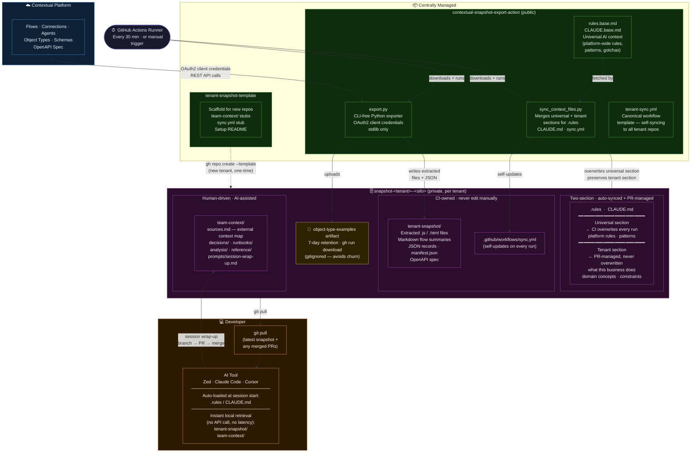

# Git-Backed Tenant Snapshot — Architecture

---

## Key relationships

| Flow | Frequency | Mechanism |
|---|---|---|
| Platform → `tenant-snapshot/` | Every 30 min | GitHub Actions + `export.py` via REST API |
| Action repo → `.rules` / `CLAUDE.md` / `sync.yml` | Every 30 min | `sync_context_files.py` — universal section overwritten, tenant section preserved |
| Tenant repo → developer | On demand | `git pull` |
| Developer → `team-context/` | End of session | Branch → PR → merge |
| Template → new tenant repo | Once per tenant | `gh repo create --template` |

## Content zones in the tenant repo

| Zone | Written by | Updated via | Purpose |
|---|---|---|---|
| `tenant-snapshot/` | CI only | Scheduled sync | Live platform state — flows, code, schemas, records |
| `.rules` / `CLAUDE.md` universal | CI only | Scheduled sync | Platform-wide AI session rules, auto-propagated |
| `.rules` / `CLAUDE.md` tenant | Team | PRs | Business domain context, constraints, key concepts |
| `team-context/` | Team (AI-assisted) | PRs | Accumulated knowledge — decisions, runbooks, analysis |
| Examples artifact | CI only | Each sync run | Object type exemplar records, available on demand |